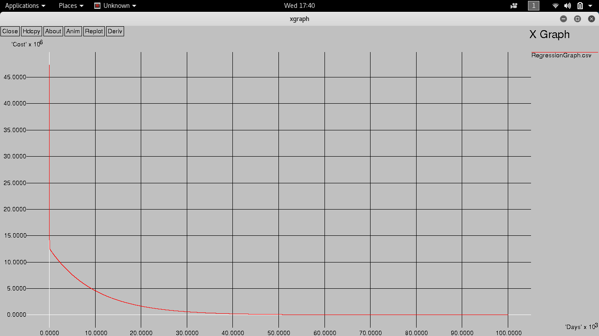
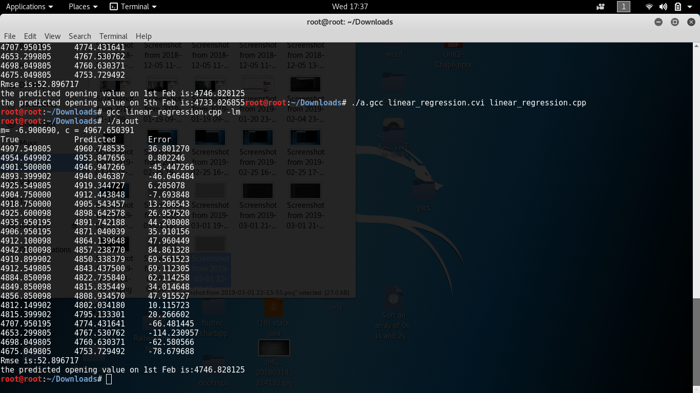

# Stock-Price-Predictions-for-next-month
This code makes use of linear regression for predicting stock prices of next month and it also produces a curve which represents error v/s epochs.

# Error V/s Epochs

# Prediction and Error values Occurred during Predictions

